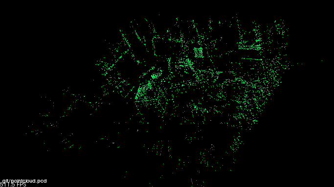
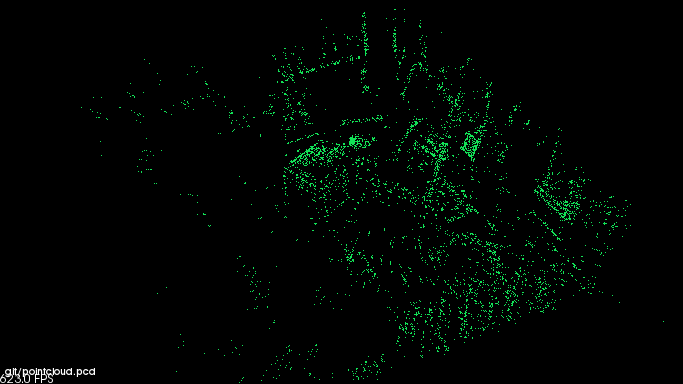
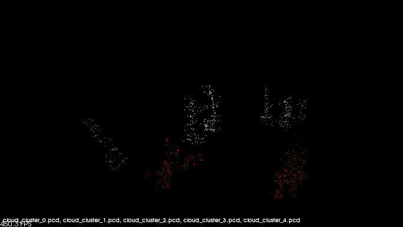
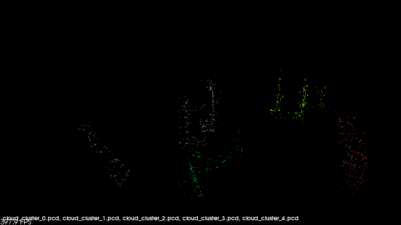

# ros_homework3 <br >Third Homework - Laboratorio Ciberfisico UniVR

The exercise is the following <http://profs.scienze.univr.it/~bloisi/corsi/homework/homework-3.pdf> (Italian)


## Getting Started

### Prerequisites

You need [ROS Kinetic](http://wiki.ros.org/kinetic/Installation) installed and working <br >
Create a new folder <br>
```
mkdir git && cd git
```

Download and install [Pangolin](https://github.com/stevenlovegrove/Pangolin) with <br> 
```
git clone https://github.com/stevenlovegrove/Pangolin.git
cd Pangolin
mkdir build
cd build
cmake ..
cmake --build .
cd ..
```

### Try it
Clone and setup my repository <br>
```
git clone https://github.com/edoardopieropan/ros_homework3.git
cd ORB_SLAM2
./build.sh
./build_ros.sh
```
You can now download the [V1_01_easy.bag](http://robotics.ethz.ch/~asl-datasets/ijrr_euroc_mav_dataset/vicon_room1/V1_01_easy/V1_01_easy.bag)<br>
Now run `bash run.sh`,three terminals will pop up. In a few seconds you will see a window waiting for an input. Select the bag terminal that is in pause and press `SPACEBAR`. Now the preovious cited window will make a pointcloud of the bag video.<br>
This modified vestion of ORB_SLAM2 let you automatically save the pointcloud in a .pcd format at the end of the execution of the bag.<br>
A guide how i did is can be found at <https://medium.com/@j.zijlmans/orb-slam-2052515bd84c><br>
You can now see the pointcloud:
```
pcl_viewer pointcloud.pcd
```
#### Screenshots
Watch the video to se the 3D pointcloud! -> [VIDEO](https://youtu.be/S3F3WERGyX8)<br>
Some screeshots:<br>
<br>
<br>

### Euclidean Cluster Extraction
Run `bash build_cluster.sh ` then by `./cluster_extraction pointcloud.pcd [value]` you can see new files .pcd that are the *Euclidean Cluster Extraction* of the pointcloud.<br>
**Example:** `./cluster_extraction pointcloud.pcd 0.28` <br>
To see those files run `pcl_viewer cloud_cluster_0.pcd cloud_cluster_1.pcd cloud_cluster_2.pcd cloud_cluster_3.pcd cloud_cluster_4.pcd`<br>

#### Screenshots
With value 0.28<br>
<br>
With value 0.30<br>
<br>

## License
Before use it I invite you to read the LICENSE <br >
This file is distributed under the terms of the GNU Lesser General Public License (Lesser GPL) <br >
Visit <http://www.gnu.org/licenses/> <br >

## References

***Laboratorio Ciberfisico*** <br >
[Robot Programming with ROS](http://profs.scienze.univr.it/%7Ebloisi/corsi/ciberfisico.html) <br >
A.Y. 2017/2018 <br >
University of Verona (Italy) <br > <br >
Repository Author: <br >
**Edoardo Pieropan**
